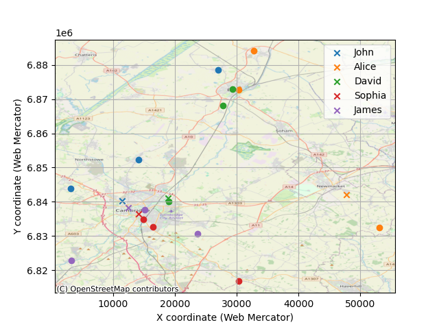

# Driver Assignment Optimization

A project for optimally assigning passengers to drivers based on minimizing travel distance. This implementation is currently tailored for the city of Cambridge, UK.

## Table of Contents

- [About the Project](#about-the-project)
- [Directory Structure](#directory-structure)
- [Getting Started](#getting-started)
  - [Prerequisites](#prerequisites)
  - [Usage](#usage)
- [Methodology](#methodology)
  - [Cost Function](#cost-function)
  - [Optimization Model](#optimization-model)
- [Visualization](#visualization)
- [Future Work](#future-work)
- [Contributing](#contributing)
- [License](#license)
- [References](#references)

## About the Project

This project provides a solution to the classic assignment problem, specifically for assigning passengers to available drivers. The core of the project is an optimization algorithm that seeks to minimize the total distance traveled by all drivers to pick up their assigned passengers.

The primary components of this project are:
- **Data Loading**: Scripts to load driver and passenger data from CSV files.
- **Cost Calculation**: A function to compute the cost (distance) matrix between drivers and passengers.
- **Optimization Solver**: An implementation using Google's OR-Tools to find the optimal assignments.
- **Visualization**: Tools to plot the assignments on a map of Cambridge.

## Directory Structure

```
/Users/kylewong/PycharmProjects/driver_assignment/
├───.gitignore
├───cb_area_codes.csv
├───data_loader.py
├───define_cost.py
├───driver_assignment_plot.png
├───ex_sample.shp
├───LICENSE
├───misc_funcs.py
├───data/
├───plots/
├───plot_map.py
├───plot_polygons.py
├───README.md
├───solve.py
├───.git/...
├───.idea/
│   ├───.gitignore
│   ├───driver_assignment.iml
│   ├───misc.xml
│   ├───modules.xml
│   ├───vcs.xml
│   └───inspectionProfiles/
│       └───profiles_settings.xml
└───docs/
    ├───define_cost.md
    ├───misc_funcs.md
    └───solve.md
```

## Documentation

This project is documented using Markdown files in the `/docs` directory. The documentation provides detailed explanations of the code, mathematical formulations, and design choices.

- [`/docs/index.md`](/docs/index.md): Central hub for all documentation.
- [`/docs/define_cost.md`](/docs/define_cost.md): Documentation for the cost function definition.
- [`/docs/misc_funcs.md`](/docs/misc_funcs.md): Documentation for miscellaneous helper functions.
- [`/docs/solve.md`](/docs/solve.md): Documentation for the main solver script.

## Getting Started

To get a local copy up and running, follow these simple steps.

### Prerequisites

This project requires Python 3 and the following libraries. You can install them using pip:

```sh
pip install pandas numpy ortools pyproj
```

### Usage

The main script to run the assignment is `solve.py`. You can execute it from the command line:

```sh
python solve.py
```

The script will print the assignments of passengers to drivers and the total minimized distance.

## Methodology

The assignment problem is modeled as a cost minimization problem, where the cost is the distance between drivers and passengers.

### Cost Function

The distance between two geographical points (latitude and longitude) is calculated using the Haversine formula [[1]](#ref-haversine). This formula calculates the great-circle distance between two points on a sphere, which is a good approximation for the Earth's surface.

The Haversine formula is given by:

$a = \sin^2(\frac{\Delta\phi}{2}) + \cos(\phi_1) \cdot \cos(\phi_2) \cdot \sin^2(\frac{\Delta\lambda}{2})$

$c = 2 \cdot \text{atan2}(\sqrt{a}, \sqrt{1-a})$

$d = R \cdot c$

where:
- $\phi$ is latitude, $\lambda$ is longitude
- $\Delta\phi$ and $\Delta\lambda$ are the differences in latitude and longitude
- $R$ is the radius of the Earth (approximately 6371 km [[2]](#ref-nasa-earth))
- $d$ is the distance between the two points

### Optimization Model

The assignment problem is solved using Google's CP-SAT solver [[3]](#ref-google-cpsat). The model is set up with the following variables and constraints:

- **Variables**: A set of boolean variables $x_{ij}$, where $x_{ij}$ is true if driver $i$ is assigned to passenger $j$, and false otherwise.

- **Constraints**:
    1.  **Each passenger is assigned to exactly one driver**:
        $\sum_{i=1}^{N_d} x_{ij} = 1 \quad \forall j \in \{1, ..., N_p\}$
        where $N_d$ is the number of drivers and $N_p$ is the number of passengers.

    2.  **Each driver is assigned a limited number of passengers**:
        $\sum_{j=1}^{N_p} x_{ij} \le C_i \quad \forall i \in \{1, ..., N_d\}$
        where $C_i$ is the capacity of driver $i$'s car (currently hardcoded to 3).

- **Objective**: The objective is to minimize the total cost (distance):
    $\text{minimize} \sum_{i=1}^{N_d} \sum_{j=1}^{N_p} d_{ij} x_{ij}$
    where $d_{ij}$ is the distance between driver $i$ and passenger $j$.

## Visualization

The project includes scripts to visualize the driver assignments on a map of Cambridge. An example of the output is shown below:



### Additional Examples


## Future Work

- Implement a traveling salesman algorithm to determine the pick-up order for each driver.
- Quantify the error of the current approximation compared to a full brute-force solution.
- Incorporate destination information into the cost function.
- Use road network distance (e.g., from an API like Google Maps) instead of straight-line physical distance.
- Allow for variable car sizes for each driver.

## Contributing

Contributions are what make the open-source community such an amazing place to learn, inspire, and create. Any contributions you make are **greatly appreciated**.

1.  Fork the Project
2.  Create your Feature Branch (`git checkout -b feature/AmazingFeature`)
3.  Commit your Changes (`git commit -m 'Add some AmazingFeature'`)
4.  Push to the Branch (`git push origin feature/AmazingFeature`)
5.  Open a Pull Request

## License

Distributed under the MIT License. See `LICENSE` for more information.

## References

<span id="ref-haversine">[1]</span> Wikipedia. (2023). *Haversine formula*. [https://en.wikipedia.org/wiki/Haversine_formula](https://en.wikipedia.org/wiki/Haversine_formula)

<span id="ref-nasa-earth">[2]</span> NASA. (n.d.). *Earth Fact Sheet*. [https://nssdc.gsfc.nasa.gov/planetary/factsheet/earthfact.html](https://nssdc.gsfc.nasa.gov/planetary/factsheet/earthfact.html)

<span id="ref-google-cpsat">[3]</span> Google for Developers. (n.d.). *CP-SAT Solver*. [https://developers.google.com/optimization/cp/cp_solver](https://developers.google.com/optimization/cp/cp_solver)
